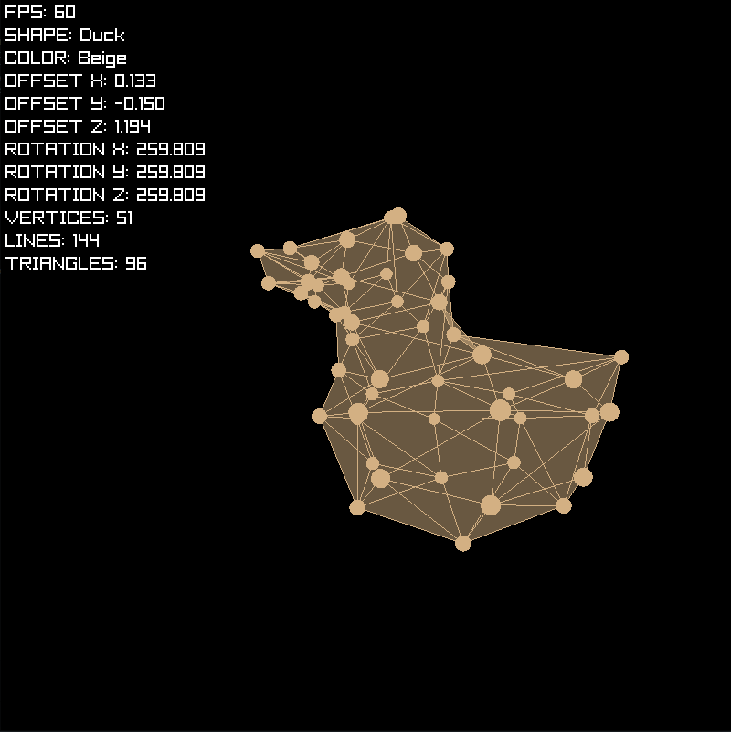

# 3D Toy Renderer
3D toy renderer is a small renderer that can render 3D models from a list of points, lines and triangles. It also supports 3D rotation in X, Y and Z axis. It does not use any of Raylib's 3D rendering functions or a 3D camera. List of models can be found in [source/shapes.c](source/shapes.c).

The program begins by loading all model points, lines and triangles. It rotates the points around an origin, which is the average of each points Z coordinate. Then it translates that point to screen coordinates, stores it and draws a circle with the radius divided by the rotated position's Z coordinate. This makes the point appear smaller the farther it is. Next up, lines get rendered, they simply connect two stored points and do no calculations whatsoever. And finally, triangles get rendered, they also just use stored points and do no calculations. Interestingly, Raylib automatically draws a triangle only from one side, meaning no face sorting has to be done.
## Controls
- A, D - move left/right
- S, W - move forwards/backwards
- Q, E - move up/down
- R - reset position and rotation
- F - change model
- C - change color
- ESCAPE - exit
- I - toggle drawing indices of vertices
- O - toggle drawing vertices
- L - toggle drawing lines
- T - toggle drawing triangles
- H - toggle statistics

## License
This project is licensed under the [MIT License](LICENSE). Feel free to copy, edit and distribute the code.